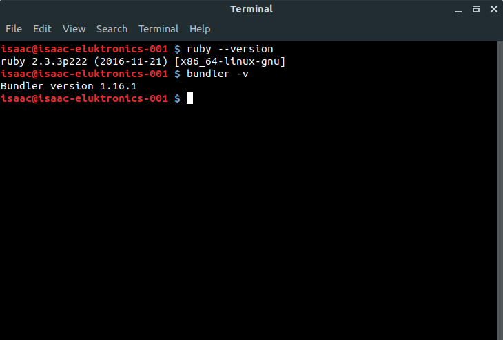

# CSCI 305 Programming Languages

## Extra Credit Homework 0: Learning Git

### Due Date: January 26, 2018

## Instructions:

1.  Create an account at [GitHub](http://github.com), if you don't already have one
2.  Install Git on you system:
    *   [Installing Git on Windows](https://gist.github.com/derhuerst/1b15ff4652a867391f03#file-windows-md)
    *   [Installing Git on Mac](https://gist.github.com/derhuerst/1b15ff4652a867391f03#file-mac-md)
    *   [Installing Git on Linux](https://gist.github.com/derhuerst/1b15ff4652a867391f03#file-linux-md)
3.  Generate your GPG key and add it to your GitHub account so that you can sign your changes.
    *   Generating the GPG key:
        *   [On Windows](https://help.github.com/articles/generating-a-new-gpg-key/#platform-windows)
        *   [On Mac](https://help.github.com/articles/generating-a-new-gpg-key/#platform-mac)
        *   [On Linux](https://help.github.com/articles/generating-a-new-gpg-key/#platform-linux)
    *   Adding the new key to your GitHub account
        *   [Adding a new GPG Key](https://help.github.com/articles/adding-a-new-gpg-key-to-your-github-account/)
4.  Complete the following git [tutorial](https://try.github.io/levels/1/challenges/1)
5.  On the finish page, which tells you about your badge, take a screenshot and save it as a PNG image file, which you will submit on BrightSpace.
6.  Go to the [ruby lab site](https://github.com/CSCI305/csci305-ruby-lab/), which is the first course lab, and Fork the repository.
    *   Use the following [tutorial](https://help.github.com/articles/fork-a-repo/) if you are unfamiliar with forking a repository.
7.  Follow the appropriate link under the section **Ruby** of the ruby lab [README](https://github.com/CSCI305/csci305-ruby-lab/) and install Ruby on your system. Then follow the instructions in the section labeled **Step 0** to install `bundler`.
    *   Open a console on your system and run the following commands:

    ```
      ruby --Version

      bundler -v
    ```

    *   Take a screen shot of only the console window showing the results of that, it should look something like this:
    

## Submission:

You will need to submit a zip file named [first_name].[last_name]_hw0.zip (where [first_name] should be replaced by your first name and [last_name] should be replaced by your last name) containing the following two files:
1. The image of the screenshot (5 pts)
2. Screenshot showing that you have installed Ruby and associated tools (2 pts)

In the comment section of the submission, place the link to your GitHub page (3 pts).
