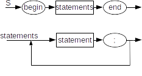
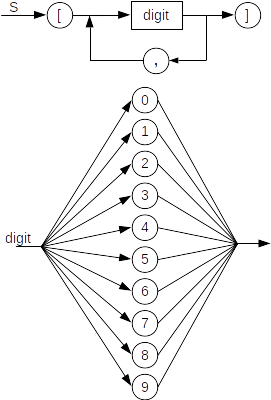

<center>

<h1>CSCI 305 Homework 1</h1>

<h3>Due Date: February 9, 2018 @ Beginning of Class</h3>
<br />
<br />

<h4>Name:<u>&nbsp;&nbsp;&nbsp;&nbsp;&nbsp;&nbsp;&nbsp;&nbsp;&nbsp;&nbsp;
&nbsp;&nbsp;&nbsp;&nbsp;&nbsp;&nbsp;&nbsp;&nbsp;&nbsp;&nbsp;&nbsp;&nbsp;
&nbsp;&nbsp;&nbsp;&nbsp;&nbsp;&nbsp;&nbsp;&nbsp;&nbsp;&nbsp;&nbsp;&nbsp;
&nbsp;&nbsp;&nbsp;&nbsp;&nbsp;&nbsp;&nbsp;&nbsp;&nbsp;&nbsp;&nbsp;&nbsp;
&nbsp;&nbsp;&nbsp;&nbsp;&nbsp;&nbsp;&nbsp;&nbsp;&nbsp;&nbsp;&nbsp;&nbsp;
&nbsp;&nbsp;&nbsp;&nbsp;&nbsp;&nbsp;&nbsp;&nbsp;&nbsp;&nbsp;&nbsp;&nbsp;
&nbsp;&nbsp;&nbsp;&nbsp;&nbsp;&nbsp;&nbsp;&nbsp;&nbsp;&nbsp;&nbsp;&nbsp;</u></h4>

</center>
<br />
<br />
<br />

### History

**Instruction:** Select the single best answer (unless directed otherwise by the question) which answers the question. **(Grading Notes: -0.5 for any missing correct answers or any incorrect answers up to the number of points assigned the question.)**

1. What is the name of the paradigm that is based on formal logic and expresses facts and rules about some problem domain?

   a. functional

   b. concurrent

   **c. logic**

   d. non-deterministic

   e. metaprogramming

   f. object-oriented

   g. declarative

   h. imperative

2. What is the name of the paradigm that treats computation as the evaluation of mathematical functions and avoids changing-state and mutable data?

   a. event-driven

   b. concurrent

   c. scripting

   d. object-oriented

   e. logic

   f. imperative

   g. declarative

   **h. functional**

   i. metaprogramming

   j. non-deterministic

3. What language was the first to introduce some object-oriented concepts (but is not a fully object-oriented language)?

   a. COBOL

   b. LISP

   c. Fortran

   **d. Simula**

   e. Smalltalk

   f. PL/I

   g. Ada

   h. Algol

   i. BASIC

   j. C

4. What language is considered to be ther first fully object-oriented language?

   **a. Smalltalk**

   b. C

   c. BASIC

   d. Simula

   e. Algol

   f. PL/I

   g. Fortran

   h. Ada

   i. COBOL

   j. LISP

5. Research "typeless language". Select **ALL** from the below that are **DISadvantages** of a typeless language

   a. It is often useful for very low-level languages used for systems programming

   b. It provides great flexibility for the programmer.

   c. Programmers can make changes to existing code in less time.

   **d. Type checking is impossible; it is the programmer's responsibility to ensure that expressions and assignments are correct.**

   **e. Reading the code of another person may be more difficult.**

   f. Such a language is easier to learn as a first programming language.

   **g. It leads to an increase in the possibility of run-time errors.**

   **h. It results in poor reliability in type conversion and checking.**

### Grammar and Syntax
1.  Construct a BNF grammar for each of the following languages. For example, a correct answer for "the set of all strings consisting of zero or more concatenated copies of the string `ab`" would be:
    ```
    <S> ::= ab <S> | <empty>
    ```

    a. The set of all strings consisting of the keyword `begin`, followed by one or more statements with a semicolon after each one, followed by the keyword `end`. Use the non-terminal `<statement>` for statements, and do not give productions for it. (2pts) **(Grading Notes: +0.5 for both begin and end terminals, +0.5 for use of rule `<statments>` or something similar, +0.5 for the `<statements>` rule being defined to produce a list of one or more statements (if `<empty>` is an alternative then -1, due to missing the concept))**

    ```
      <S> ::= begin <statements> end
      <statements> ::= <statement> ;
                   | <statement> ; <statements>
    ```

    b. The set of all strings consisting of an open bracket (the symbol `[`) followed by a list of one or more digits separated by commas, followed by a closing bracket (the symbol `]`). (2 pts) **(Grading Notes: +0.5 for both `[` and `]` terminals in the start rule, +0.5 for a second level rule creating the digit list, `<digit-list>` rule must be defined such that it will produce a comma separated list of digits, -1 if `<digit-list>` rule or `<digit>` has an alternative `<empty>`).**

    ```
      <S> ::= [ <digit-list> ]
      <digit-list> ::= <digit>
                   | <digit> , <digit-list>
      <digit> ::= 0 | 1 | 2 | 3 | 4 | 5 | 6 | 7 | 8 | 9
    ```

2.  Construct an EBNF grammar for each of the languages in Grammars Question 1. Use the EBNF extensions wherever possible to simplify the grammars. In particular, you should eliminate explicit recursion form the grammars wherever possible. Don't forget to put single quotes around any EBNF metasymbol when using it as a token. **(Grading Notes: -1 if any rule uses regular expression syntax).**

    a. (2 pts) **(Grading Notes: +0.5 for the terminals begin, end, and appropriate semi-colons, +1.5 for the correct construction of the list)**
    ```
      <S> ::= begin <statement> ; { <statement> ;} end
    ```
    <br />

    b. (2 pts) **(Grading Notes: +0.5 for the termainals `[` and `]` in quotes and the terminal `,`, +1.0 for the correct construction of the list, and +0.5 for the digit list)**
    ```
      <S> ::= '[' <digit> {, <digit>} ']'
      <digit> ::= 0 | 1 | 2 | 3 | 4 | 5 | 6 | 7 | 8 | 9
    ```

3.  Construct a syntax diagram for each of the languages in Grammars Question 1. Use branching and loops in your syntax diagrams to make them as clear as possible. **(Grading Notes: For both diagrams, -1.0 for incorrect shapes: Rectangles for non-terminals, Circles/Ovals for terminals, and arrows between everything)**

    a. (3 pts) **Grading Note: +1.0 for Path that guarantees a single `begin <statement> end` combination, and +1.0 for a Path that produces one or more statements separated by commas (i.e. using a loop).**

    
    
    b. (3 pts) **Grading Note: +1.0 for a Path that guarantees a single `[ <digit> ]` combination, and +1.0 for a Path that produces one or more digits separated by commas (i.e. using a loop). -1.0 if the digit branch is missing.**

    
