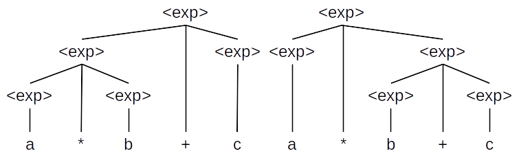
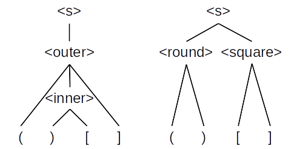

# CSCI 305 Programming Languages

## Syntax and Semantics

**Reading:** Webster Ch. 3

## Outside The Classroom

### Instructions
1. [Watch This Video](https://youtu.be/K_uCkUBnBv0) - (26:15)
2. [Watch This Video](https://youtu.be/V40CWH9QLTo) - (10:44)
3. [EBNF Clarification Video](https://youtu.be/54dkAZCall8)
4. Complete the out of class exercise
5. Review the [Lecture Slides](slides/Lecture07_08.pdf)

### Out of Class Exercise:
Show that the following grammar is ambiguous. (To show this, you must demonstrate that it can generate two parse trees for the same string).

```
<exp> ::= <exp> + <exp>
      | <exp> * <exp>
      | ( <exp> )
      | a | b | c
```

#### Check your Learning:

##### [Solution Video](https://youtu.be/OJkf4nxowa8) - (04:30)

##### Solution:



### In Class Exercise:

#### Exercise 2
Redefine the following grammar to be unambiguous.
```
<exp> ::= <exp> + <exp>
      | <exp> * <exp>
      | ( <exp> )
      | a | b | c
```

#### Check your Learning:

##### [Solution Video](https://youtu.be/6KTLGaE5qmI) - (07:16)

##### Solution:

```
<exp> ::= <exp> + <rootexp> | <exp> * <rootexp> | <rootexp>
<rootexp> ::= ( <exp> ) | a | b | c
```

#### Exercise 3
Show that the following grammar is ambiguous.

```
<s> ::= <round> <square> | <outer>
<round> ::= ( <round> ) | ()
<square> ::= [ <square> ] | []
<outer> ::= ( <outer> ] | ( <inner> ]
<inner> ::= ) <inner> [ | ) [
```

#### Check your Learning:

##### [Solution Video](https://youtu.be/wAq_9SRqAlw) - (05:46)

##### Solution:


