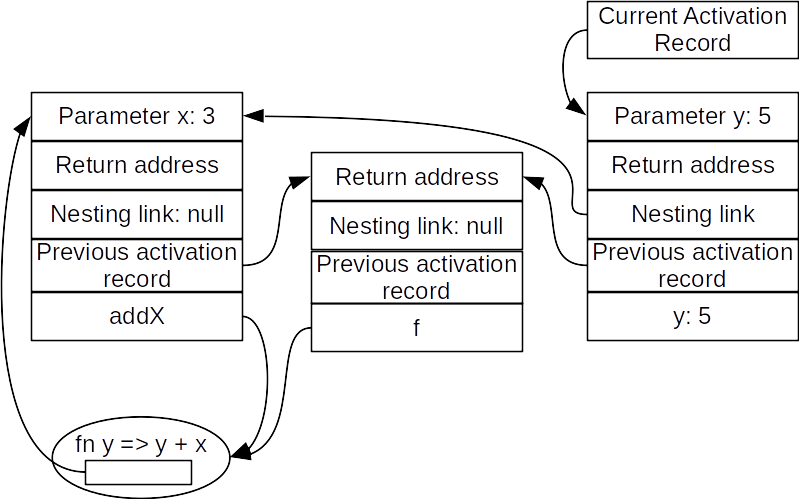

# CSCI 305: Programming Languages

### Memory Locations for Variables

**Reading:** Webster Ch. 12

### Instructions
1. [Watch This Video (part 1)](https://youtu.be/sL7FKbWorRU) - (17:42)
2. [Watch This Video (part 2)](https://youtu.be/oWNVyWUbphc) - (10:51)
3. [Watch This Video (part 3)](https://youtu.be/TAU0BAqDAxk) - (20:28)
4. Review the [Lecture Slides](slides/Lecture23.pdf)
5. Complete the Out of Class Exercise
6. Check your learning
7. Attend Class and complete the In Class Exercises
8. Check your learning

### Out of Class Exercise

#### Exercise 1
Continuing the example of the `test` function on page 201 in the book, draw the activation records and links that show the situation when function `f` has been called and is about to return to its caller (`test`).

#### Check Your Learning:

##### Solution:



#### Exercise 2
For the following ML function, could the activation record for the function be deallocated as soon as the function returns? Explain why or why not.

- `fun f x = fn y => y + 1;`

#### Check Your Learning:

##### Solution:
Yes. Because the inner function (`fn y => y + 1`) does not have any dependency on the outer function (that is, it does not use any variables defined in the outer function) and hence would not require the need to follow its nesting link to retrieve any information.

#### Exercise 3
The following ML function contains a function call that passes a function parameter `f`. Will the function `f` use its nesting link when it is called? Explain. (Assume that the nesting link is *not* used to resolve references to predefined operators (like `+`) and functions (like `map`))

```ml
fun addone theList =
  let fun f x = x + 1;
  in map f theList
  end;
```

#### Check Your Learning:

##### Solution:
No. The function `addone` only uses the variable `x` which has an activation lifetime solely based on the function `f`'s activation and hence never needs to use the nesting link.

### In Class Exercises

#### Exercise 1
Consider a block-structured language implemented using nesting links. Suppose a function nested `n` levels deep makes a legitimate reference to a local variable of a function nested `m` levels deep. Describe exactly how to find the variable at runtime. *Hint*: You do not have to worry about the cases where `m > n`; be sure you explain why not.

#### Check Your Learning:

##### Solution:

#### Exercise 2
Write the shortest ML function you can that would not work correctly if implemented using statically allocated activation records. Explain why it would fail.

#### Check Your Learning:

##### Solution:

#### Exercise 3
For each of the following ML functions, could the activation record for the function be deallocated as soon as the function returns? Explain why or why not.

- `fun f x = x + 1;`
- `fun f x = map ~ x`

#### Check Your Learning:

##### Solution:
