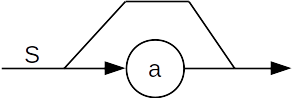
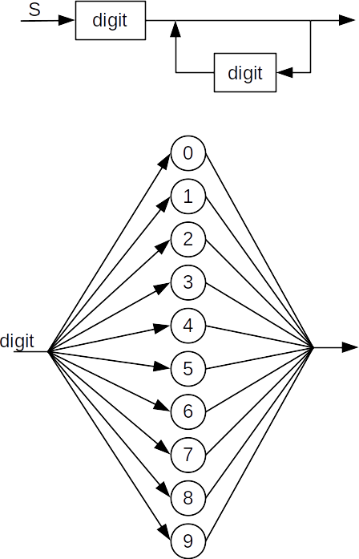
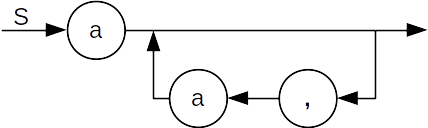

# CSCI 305: Programming Languages

## Program Syntax

## Outside Class

**Reading:** Webster Ch. 2

## In Class
### Group Exercises:
#### Exercise 1 (with solutions):
Construct a BNF grammar for each of the following languages. As an example: a correct answer for "the set of all strings consisting of zero or more concatenated copies of the string `ab`" would be the following grammar:

```
<S> ::= ab <S> | <empty>
```

a. The set of all strings consisting of zero or more `a`'s

```
 <S> ::= a <S> | <empty>
```

b. The set of all strings consisting of one or more digits. (Each digit is one of the characters 0 through 9)

```
 <S> ::= <digit> | <digit> <S>
 <digit> ::= 0 | 1 | 2 | 3 | 4 | 5 | 6 | 7 | 8 | 9
```

c. The set of all string consisting of one or more `a`'s, with a comma between each `a` and the next. (There should be no comma before the first or after the last.)

```
 <S> ::= a | a , <S>
```

d. The set of all strings consisting of an open bracket (the symbol `[`) followed by a list of zero or more digits separated by commas, followed by a closing bracket (the symbol `]`).

```
 <S> ::= [ <digit-list> ] | [ <empty> ]
 <digit-list> ::= <digit> | <digit> , <digit-list>
 <digit> ::= 0 | 1 | 2 | 3 | 4 | 5 | 6 | 7 | 8 | 9
```

#### Exercise 2 (with solutions):
Construct an EBNF grammar for each of the above languages. Use EBNF extensions wherever possible to simplify the grammars. In particular, you should eliminate explicit recursion from the grammars wherever possible. Also, don't forget to put single quotes around any EBNF metasymbols when using them as a token.

a. The set of all strings consisting of zero or more `a`'s

```
 <S> ::= {a}
```

b. The set of all strings consisting of one or more digits. (Each digit is one of the characters 0 through 9)

```
 <S> ::= <digit> {<digit>}
 <digit> ::= 0 | 1 | 2 | 3 | 4 | 5 | 6 | 7 | 8 | 9
```

c. The set of all string consisting of one or more `a`'s, with a comma between each `a` and the next. (There should be no comma before the first or after the last.)

```
 <S> ::= a {, a}
```

d. The set of all strings consisting of an open bracket (the symbol `[`) followed by a list of zero or more digits separated by commas, followed by a closing bracket (the symbol `]`).

```
 <S> ::= '[' [<digit> {, <digit>}] ']'
 <digit> ::= 0 | 1 | 2 | 3 | 4 | 5 | 6 | 7 | 8 | 9
```

#### Exercise 3 (with solutions):
Construct a syntax diagram for language `d.` above. Use branching and loops in your syntax diagram to make it as clear as possible.

a. The set of all strings consisting of zero or more `a`'s



b. The set of all strings consisting of one or more digits. (Each digit is one of the characters 0 through 9)



c. The set of all string consisting of one or more `a`'s, with a comma between each `a` and the next. (There should be no comma before the first or after the last.)



d. The set of all strings consisting of an open bracket (the symbol `[`) followed by a list of zero or more digits separated by commas, followed by a closing bracket (the symbol `]`).


